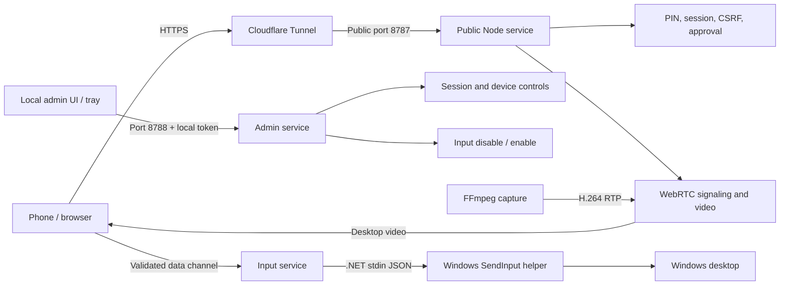

# Remote PC Control

A small self-hosted Windows remote control app for using your PC from a phone or
browser. Run `Configure-RemotePC.cmd` first, then `Start-RemotePC.cmd` and you
should be good to go. If something breaks, open an issue and I will work through
it when I can.

> This software can expose control of a real PC. Use a unique PIN, keep `.env`
> and `data/` private, and only run it on machines you own or administer.

## Features

- Windows screen capture through FFmpeg `gdigrab`, with optional `ddagrab`
- WebRTC H.264 video through Werift
- NVIDIA NVENC, Intel Quick Sync, AMD AMF, then x264 fallback
- Native Windows mouse and keyboard input through a supervised .NET helper
- Mobile UI with touch, joystick, scrolling, keyboard, reconnect, and stats
- Signed sessions, CSRF protection, persistent login throttling, and device approval
- A token-protected administration service that is not exposed through the tunnel
- Cloudflare Quick Tunnel or named tunnel support
- Optional Discord link and status notifications
- Watchdog restart loop, local logs, and SQLite state

## Architecture



The public and administration listeners are deliberately separate. `cloudflared`
targets only the public port. The administration listener always binds to
`127.0.0.1` and requires the random token stored in `data/admin.key`.

See [docs/ARCHITECTURE.md](docs/ARCHITECTURE.md) for the trust boundaries.

## Project Structure

```text
src/client/                  Browser and mobile UI
src/host/                    Public/admin servers, auth, signaling, watchdog
src/host/stream/             FFmpeg capture and RTP pipeline
src/host/input/              Input-helper supervisor
src/host/webrtc/             Werift WebRTC session manager
native/RemotePc.InputHost/   Windows SendInput helper
tests/                       Security-boundary and validation tests
scripts/                     Windows setup, lifecycle, and release scripts
docs/                        Architecture, security, and publishing notes
```

Runtime directories such as `data/`, `logs/`, `dist/`, `release/`, and
`node_modules/` are ignored by Git.

## Requirements

- Windows 10 or 11
- WinGet, included with the Windows App Installer

`Start-RemotePC.cmd` checks for Node.js 24+, npm, .NET SDK 8+, FFmpeg, and
`cloudflared`. On the first run it uses WinGet to install anything missing.
Cloudflared is skipped when remote access is disabled. Windows may request
administrator approval during installation.

## Quick Start

1. Download or clone the source.
2. Double-click `Configure-RemotePC.cmd`.
3. Choose an 8 to 12 digit control PIN and whether new devices require local approval.
4. Configure Cloudflare, streaming, and optional Discord notifications.
5. Double-click `Start-RemotePC.cmd`.
6. Allow any first-run software installations. Project dependencies and builds
   are handled automatically.
7. Open the printed remote link and enter the PIN.
8. If approval is enabled, approve the device from the local admin panel.

Stop the background host with `Stop-RemotePC.cmd`.

`Start-RemotePC.cmd` opens the administration panel with a token in the URL
fragment. The fragment is removed from the address bar and retained only in the
browser tab's session storage.

## Manual Setup

Create the local environment file:

```powershell
Copy-Item .env.example .env
```

Set at least:

```env
REMOTE_PC_SECRET=use-a-long-random-value-at-least-32-characters
REMOTE_PC_PIN=1234567890
REMOTE_PC_REQUIRE_LOCAL_APPROVAL=true
```

The PIN must contain 8 to 12 digits. The setup scripts generate a random 10-digit
PIN when the existing value is missing or too short.

Build and start:

```powershell
npm install
npm run build
npm run build:input
npm start
```

The public service binds to `127.0.0.1:8787` by default. The local administration
service binds separately to `127.0.0.1:8788`.

## Configuration

`Configure-RemotePC.cmd` writes local settings to `.env`. It can configure:

- Control PIN and local device approval
- Public and administration ports
- Discord webhook
- Cloudflare Quick or named tunnel
- FFmpeg and capture backend
- Stream resolution, quality, and FPS
- Emergency input-disable hotkey

Generated session and administrator keys are stored under `data/`. Do not copy
them into source releases.

## Cloudflare Remote Access

Quick Tunnel mode runs:

```text
cloudflared tunnel --url http://127.0.0.1:8787
```

Quick tunnels are suitable for temporary or personal testing. For ongoing
internet exposure, use a named tunnel protected by
[Cloudflare Access](https://developers.cloudflare.com/cloudflare-one/access-controls/applications/http-apps/).
The application PIN remains required; Access is an additional boundary.

Example named-tunnel application settings:

```env
CLOUDFLARE_ENABLED=true
CLOUDFLARE_MODE=named
CLOUDFLARE_NAMED_TUNNEL_NAME=my-tunnel
CLOUDFLARE_NAMED_TUNNEL_CONFIG=C:\Users\you\.cloudflared\config.yml
CLOUDFLARE_FIXED_DOMAIN=https://remote.example.com
```

Only the public port belongs in the tunnel configuration. Never route the
administration port through Cloudflare or another reverse proxy.

## Security Model

- Full control requires the configured PIN.
- New devices require local approval by default.
- Login throttling persists in SQLite across host restarts and includes both
  per-client and global limits.
- Sessions are signed, expire automatically, and are restricted by the current
  trusted-device record.
- Mutating public HTTP APIs require CSRF tokens.
- WebSocket handshakes require an authenticated session and matching origin.
- Signaling and input messages have runtime schemas and payload-size limits.
- Administration uses a separate loopback listener and a generated 48-byte token.
- Blocking or removing a device terminates active WebRTC sessions.
- Input can be disabled immediately from the tray, local panel, or emergency hotkey.

Do not publish `.env`, `data/`, `logs/`, webhook URLs, tunnel credentials,
generated keys, or local databases.

## Streaming

Default settings:

```env
STREAM_PRESET=low-latency
STREAM_CAPTURE_BACKEND=gdigrab
STREAM_WIDTH=1280
STREAM_HEIGHT=720
STREAM_FPS=60
STREAM_FORCE_ENCODER=
```

Encoder preference:

1. `h264_nvenc`
2. `h264_qsv`
3. `h264_amf`
4. `libx264`

`gdigrab` is the stable default. Set `STREAM_CAPTURE_BACKEND=ddagrab` if Desktop
Duplication performs better on the host.

## TURN Fallback

Cloudflare exposes the web application and signaling, but strict NATs may still
require TURN for WebRTC media.

The included Coturn configuration refuses to start without an explicit password:

```powershell
$env:TURN_USERNAME = "remote"
$env:TURN_PASSWORD = [Convert]::ToBase64String(
  [Security.Cryptography.RandomNumberGenerator]::GetBytes(32)
)
docker compose up -d coturn
```

Run Coturn on a host with a public IP, configure its firewall for port 3478 and
the configured relay range, then set:

```env
STREAM_TURN_URLS=turn:your-turn-host:3478
STREAM_TURN_USERNAME=remote
STREAM_TURN_CREDENTIAL=your-generated-password
```

## Windows Tray

Build the host and Electron main process:

```powershell
npm run build
npm run electron:build-main
```

Run the tray shell during development:

```powershell
npm run electron:dev
```

The tray provides status, startup registration, session termination, input
disable/enable actions, and the emergency hotkey.

## Development and Verification

```powershell
npm install
npm run verify
```

`npm run verify` checks formatting, linting, TypeScript, security regression
tests, the web/host builds, the native input build, and the production dependency
audit. The same command runs on Windows in GitHub Actions.

Individual commands:

- `npm run dev`: host and web development servers
- `npm run typecheck`: client, host, Electron, and test type-checking
- `npm test`: security-boundary and validation tests
- `npm run lint`: ESLint
- `npm run build`: web and Node host builds
- `npm run build:input`: native input build

## Releases

The current release path is source code plus an optional source-oriented ZIP.
`Create-ReleaseZip.cmd` removes native binaries, PDB files, local configuration,
runtime state, and dependency folders, then checks the staging directory for
forbidden files and secret-like URLs.

Do not distribute unsigned executable builds as official releases. See
[docs/RELEASE.md](docs/RELEASE.md).

## Troubleshooting

- Missing requirement installation fails: update App Installer from Microsoft
  Store, then run `Start-RemotePC.cmd` again. You can also install the package
  named in the error manually.
- Host rejects the PIN: rerun `Configure-RemotePC.cmd`; older PINs under eight
  digits are intentionally rejected.
- Waiting for approval: open the local panel through `Start-RemotePC.cmd` and
  approve the pending device.
- Local panel says authentication failed: close it and reopen it through the
  start script or tray so it receives the current administrator token.
- No stream: check `logs/host.log` and try `STREAM_FORCE_ENCODER=libx264`.
- Black capture: secure desktops and UAC prompts cannot be captured normally.
- Remote URL missing: run `cloudflared --version`, then inspect `logs/host.log`.
- Bad mobile network: lower resolution or configure TURN.

## Contributing and Security

See [CONTRIBUTING.md](CONTRIBUTING.md) before submitting changes. Report
vulnerabilities privately as described in [SECURITY.md](SECURITY.md).

## License

MIT. See [LICENSE](LICENSE).
