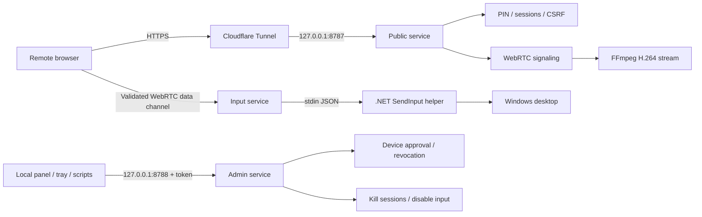

# Architecture

Remote PC Control separates internet-facing behavior from local administration.

## Components

- `src/client`: remote-control UI and token-authenticated local host panel.
- `src/host/server.ts`: separate public and administration HTTP servers.
- `src/host/auth.ts`: PIN login, signed cookies, CSRF, approval state, and throttling.
- `src/host/store.ts`: trusted devices, audit events, and persistent login limits.
- `src/host/webrtc`: authenticated peer sessions and validated control messages.
- `src/host/stream`: FFmpeg capture and RTP forwarding.
- `src/host/input`: supervisor for the native input helper.
- `native/RemotePc.InputHost`: Windows `SendInput` implementation.

## Trust Boundaries

### Public listener

The public listener binds to the configured `REMOTE_PC_HOST` and
`REMOTE_PC_PORT`. Cloudflare targets this listener. It exposes only login,
session, stream-control, static-client, and WebRTC signaling routes.

It does not expose `/host` or `/api/host/*`.

### Administration listener

The administration listener always binds to `127.0.0.1` on
`REMOTE_PC_ADMIN_PORT`. Every administration API call requires the random token
stored in `data/admin.key`.

Loopback source addresses are not treated as authorization. This matters because
local reverse proxies such as `cloudflared` also connect from loopback.

### Native input

The input helper accepts newline-delimited JSON only from the local Node process.
Remote messages pass through authentication, permission checks, runtime schemas,
size limits, and the host input-enabled switch before reaching the helper.

## Security Invariants

- The tunnel targets only the public port.
- Administration requires a local token, even from loopback.
- New devices remain unusable until approved when local approval is enabled.
- Blocking or removing a device closes active peer sessions.
- WebSocket origins must match the request host or configured public origin.
- Unauthenticated clients cannot create WebRTC peer sessions.
- Secrets and runtime state remain under ignored local paths.
